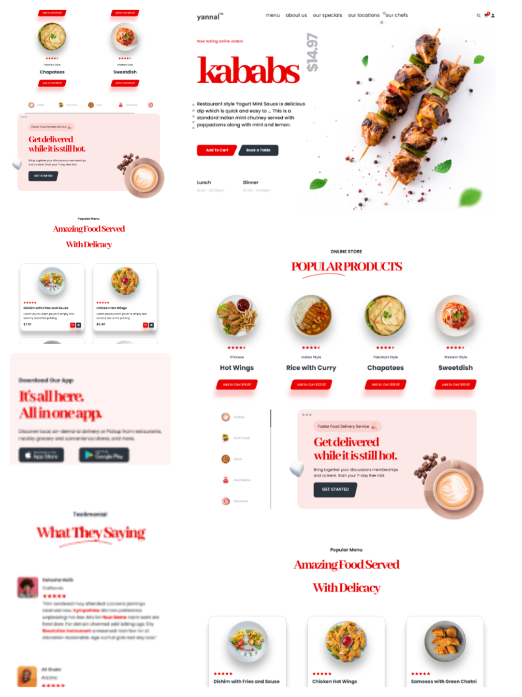

# 🍽️ Yannal Restaurant - Responsive Restaurant Landing Page

A stylish and fully responsive restaurant landing page built with **HTML5** and **CSS3** as my third project during my front-end development journey.

 

## 🚀 Live Demo

[🔗 Click here to view live](https://yannal-resturant-project.vercel.app/)

---

## 🛠️ Technologies Used

- ✅ HTML5 semantic structure
- ✅ CSS3 custom styling
- ✅ Responsive design with Media Queries
- ✅ Flexbox layout system
- ✅ FontAwesome icons
- ✅ Google Fonts
- ✅ CSS Animations & `@keyframes`
- ✅ `clip-path` custom shaped buttons and elements
- ✅ Drop shadows using `filter: drop-shadow(...)`

---

## 🎯 Key Features

- 💡 **Responsive Design** – fully optimized for desktop, tablet, and mobile views.
- 🎨 **Modern UI** – clean layout with bold typography and interactive visuals.
- 🍔 **Product Cards** – with hover effects and stylized "Add to Cart" buttons.
- ⚡ **Fast Services Section** – custom-designed product filters with vertical indicator.
- 🎞️ **Animated Elements** – rotating images and hover-based transitions.
- 🧠 **Well-structured Code** – easy to read and maintain.

---

## 💡 What I Learned

> Through this project, I practiced responsive layout techniques, custom button shapes with `clip-path`, and organized scalable CSS. Compared to my first two projects, this one reflects a stronger sense of UI/UX and real-world layout planning.

---

## 📌 Author

**Mustafa Hawash**  
📧 hiohio855@gmail.com  
🔗 [LinkedIn](https://www.linkedin.com/in/moustafa-hawash-180107217) | [GitHub](https://github.com/mustafaHawash)

---

